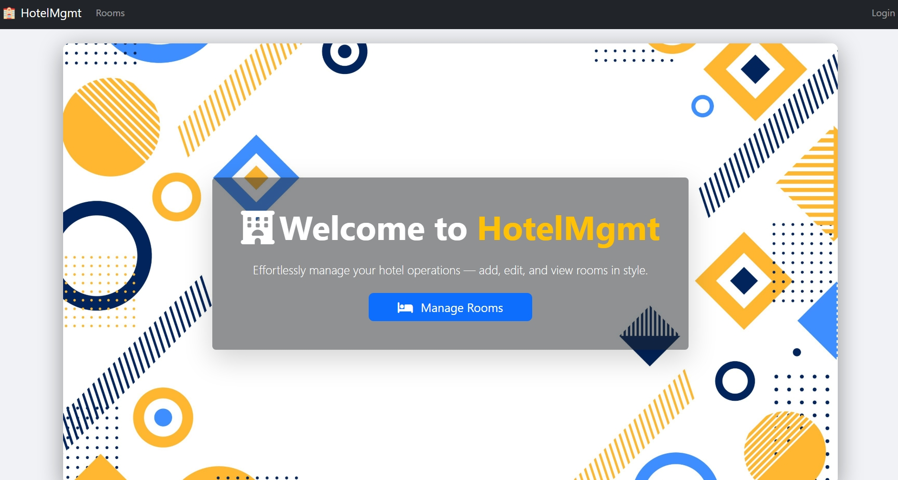
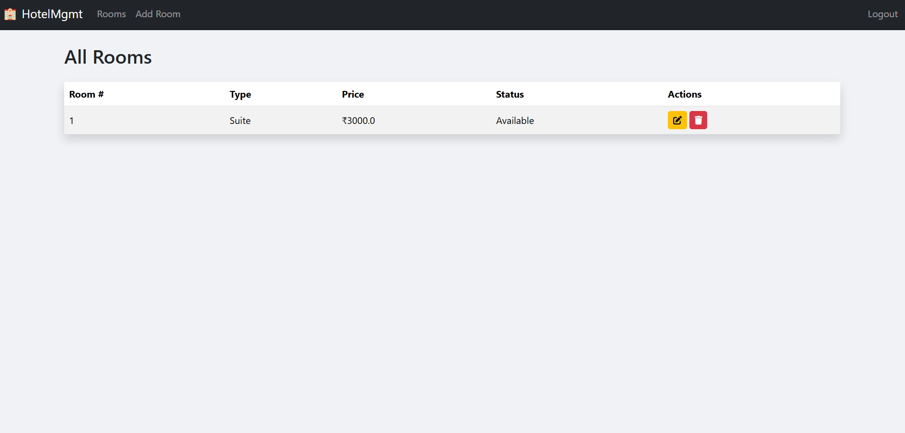
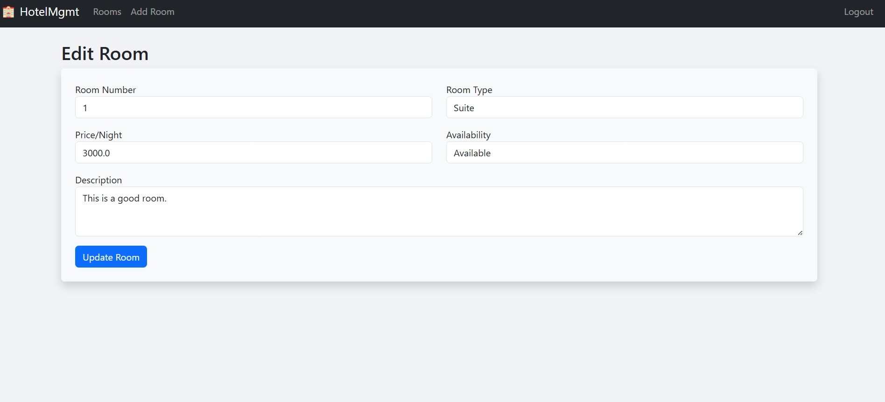

# Hotel Management System (HMS-Flask)

[](https://www.python.org/)
[](https://flask.palletsprojects.com/)
[](https://github.com/features/actions)
[](https://aws.amazon.com/ec2/)

[cite_start]Welcome to **HotelMgmt**, a cloud-native application that re-imagines hotel management through the lens of modern DevOps and security practices[cite: 1, 2, 3]. [cite_start]This project isn't just a simple CRUD app; it's a demonstration of how automation, security, and cloud infrastructure come together to build reliable, production-ready software[cite: 226].

[cite_start]**Live Demo URL:** **[http://108.129.170.142:5000/](http://108.129.170.142:5000/)** [cite: 141]

<p align="center">
  
</p>

---
## ✨ Project Philosophy

[cite_start]The core idea behind this project was to apply the concepts learned in the Cloud DevOpsSec module to a real-world scenario[cite: 21]. [cite_start]Instead of just building a piece of software, the goal was to simulate the entire lifecycle of a modern web application—from writing secure code and automating deployments to managing cloud infrastructure securely[cite: 24]. [cite_start]Every feature and architectural choice was made with a "DevSecOps first" mindset[cite: 19].

---
## 🚀 Features in Action

### **Secure Admin Dashboard**
[cite_start]A protected dashboard for hotel staff to manage room inventory[cite: 32]. [cite_start]It supports full CRUD (Create, Read, Update, Delete) operations, with access secured by a robust login system that uses hashed passwords for credential protection[cite: 5, 33, 38].

<p align="center">
  
</p>

### **Effortless Room Management**
[cite_start]Intuitive forms allow administrators to add new rooms or update existing details with ease[cite: 64, 70]. [cite_start]The system uses both front-end and server-side validation to ensure data integrity[cite: 37].

<p align="center">
  
</p>

### **Automated CI/CD Pipeline**
This project is built for speed and reliability. [cite_start]Every `git push` to the main branch automatically triggers a GitHub Actions workflow that deploys the latest version to the AWS server in seconds[cite: 8, 45, 117]. [cite_start]This pipeline eliminates manual deployment errors and ensures changes are delivered quickly and safely[cite: 154, 229].

<p align="center">
  
</p>

---
## 🏗️ Architecture & Tech Stack

[cite_start]The system is built on a modular MVC (Model-View-Controller) architecture using Flask and is hosted on an **AWS EC2** instance within a custom-configured, secure VPC in the `eu-west-1` (Ireland) region[cite: 7, 35, 56].

| Category | Technologies & Tools |
| :--- | :--- |
| **Backend** | [cite_start]`Flask`, `Python 3.11` [cite: 82, 42] |
| **Database** | [cite_start]`SQLite3` [cite: 84] |
| **Frontend** | [cite_start]`HTML`, `CSS`, `Bootstrap` [cite: 86] |
| **Cloud** | [cite_start]`AWS EC2`, `VPC`, `Security Groups` [cite: 90, 40] |
| **CI/CD** | [cite_start]`Git`, `GitHub`, `GitHub Actions` [cite: 87, 89] |
| **DevSecOps** | [cite_start]`SonarQube Cloud`, `pylint` [cite: 92, 93] |

---
## 🔧 Getting Started Locally

1.  **Clone the Repository**
    ```sh
    git clone [https://github.com/AnuragBaiju/hms-app.git](https://github.com/AnuragBaiju/hms-app.git)
    cd hms-app
    ```
2.  **Set Up and Activate a Virtual Environment**
    ```sh
    # For macOS/Linux
    python3 -m venv venv
    source venv/bin/activate

    # For Windows
    python -m venv venv
    .\venv\Scripts\activate
    ```
3.  **Install Dependencies**
    ```sh
    pip install -r requirements.txt
    ```
4.  **Initialize the Database**
    * Start a Python interactive shell (`python`).
    * Run the following commands:
        ```python
        from app import init_db
        init_db()
        exit()
        ```
5.  **Run the Flask Application**
    ```sh
    flask run
    ```
    The application will be available at `http://127.0.0.1:5000`. The default admin credentials are `admin` / `password`.

---
## Acknowledgments
[cite_start]This project was developed as a requirement for the **Cloud DevOpsSec** module in the **MSc. in Cloud Computing** program at the National College of Ireland, Dublin[cite: 2, 3, 21].
